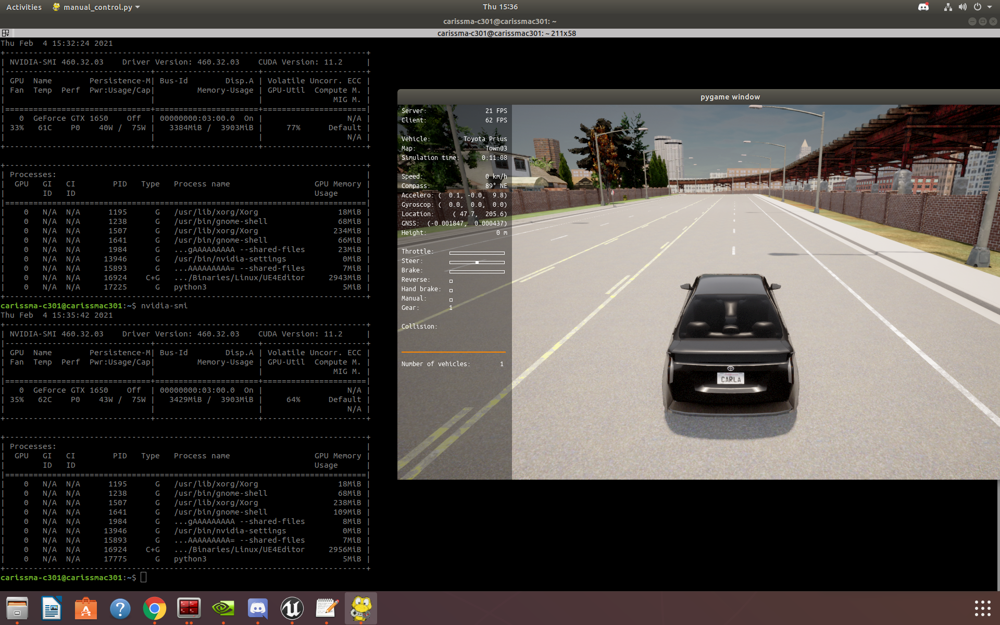
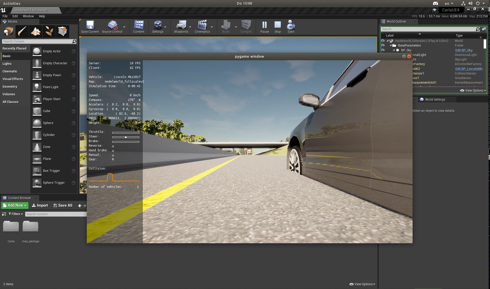
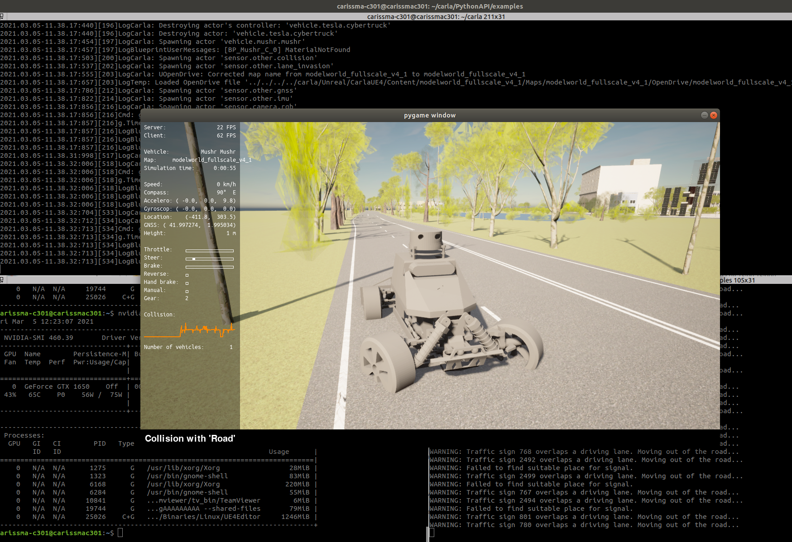
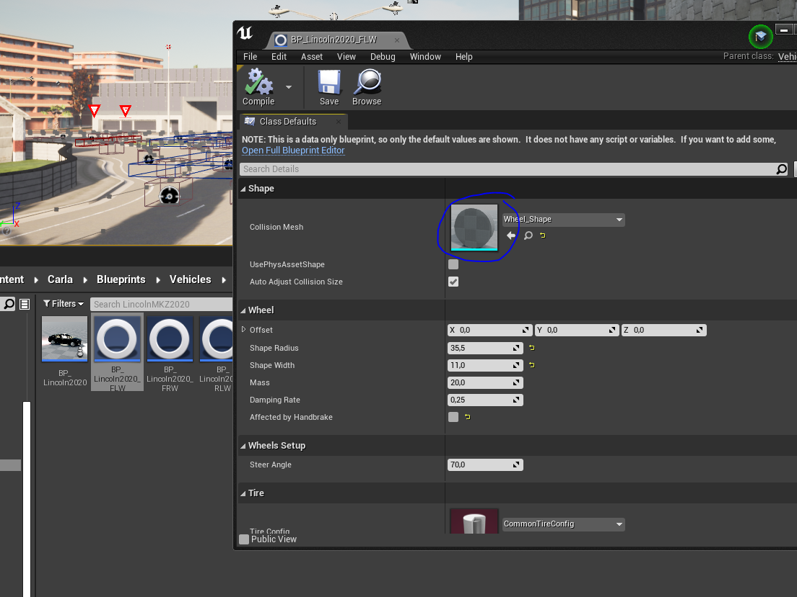

* # CARLA or Unreal Issues:

1. ## Less frame rate (3-5 FPS): 
	Go to Unreal engine Edit-> Editor Preferences -> Performance -> disable or uncheck Use less CPU when in background

	Result: Frame rate changed to approx 20 FPS, GPU utilization changed from 31% to around 70%

	The issue is highlighted here: [Github issue](https://github.com/carla-simulator/carla/issues/365)
	
	Reference Image: 

2. ## Naming the fbx or xodr files:
	CARLA has an issue with the file name involving underscores ("_"). The current working map is named as "modelworld_fullscale_v4_1".  During the import process CARLA generates static mesh actors and the nomenclature of these meshes should be like "Road_Road", "Road_Crosswalk", "Road_Curb" etc.. With the underscore in the map name the actors are generated with a different nomenclature because of a bug in CARLA. I have renamed all the roads, curbs, grass, sidewalks, crosswalks with the appropriate nomenclature. Otherwise crosswalks for pedestrian navigation will not be genearated and the generated .obj, .bin files have issues during the map ingestion process. That is step 6 in the process: https://carla.readthedocs.io/en/latest/tuto_A_add_map/#map-ingestion-in-a-build-from-source. Avoid underscores or any symbols in the name of the map.

2. ## CARLA Vehicles and custom vehicles sinks in certain regions of the custom map:
	Only a few people have come across this issue and therefore there is no a exact solution but only work around. After exporting the map files from Roadrunner without any opendrive errors the issue persists. As stated in the title the vehicles are able to drive around normally but they sink in certain regions of the map. 
	
	The issue is highlighted here: [Github issue](https://github.com/carla-simulator/carla/issues/2976)

	As suggested the only solution is to remove all the link tags from the xodr file. 

	The following regex can be used to eliminate link tags:

			<link>[\s\S]*?<\/link>
	
	Use the above regex [here](https://www.freeformatter.com/regex-tester.html). Copy the entire xodr text, leave the replace tab as blank -> Click Replace. Copy the generated output and replace it in the xodr file. Import the fbx and xodr file in CARLA, the vehlicles will be able to drive properly in this map.

	Reference Image: 

2. ## Custom vehicle (Mushr) sinks into the road and not moving:
	Carla documentation to [add a new vehicle](https://carla.readthedocs.io/en/latest/tuto_A_add_vehicle/) is not updated properly which makes the imported vehicle wheels to sink in the road. 
	While creating the blueprints for the wheels in step 6, change the Shape of the Collision mesh  to Wheel_Shape it will be by default as  cylinder

	Reference Image:
	 

2. ## ROS Bridge installation issues:
	While building the CARLA from source it generates egg files to point at correct Python versions to use. Follow the steps in the instructions to install the bridge from [here](https://carla.readthedocs.io/en/latest/ros_installation/#python-version). The installed CARLA version is 0.9.11 whereas the latest bridge is of version 0.9.10. Due to this inconsistency other than the usual error "ImportError: no module named CARLA", the error " CARLA python module version 0.9.10 required. Found: 0.9.11" is seen.

	The issue is highlighted here: [Github issue](https://github.com/carla-simulator/ros-bridge/issues/468)

	The issue can be fixed by changing the CARLA version to 0.9.11 in the file bridge.py
	
2. ## Mesh distance field
2. ## Material alpha channel
2. ## carla version to use
2. ## Nav folder
2. ## Spawn points

* # MATLAB Roadrunner and exporting:
